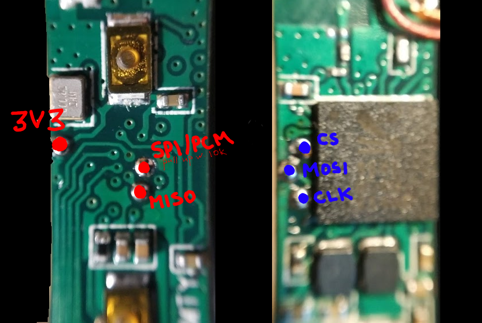
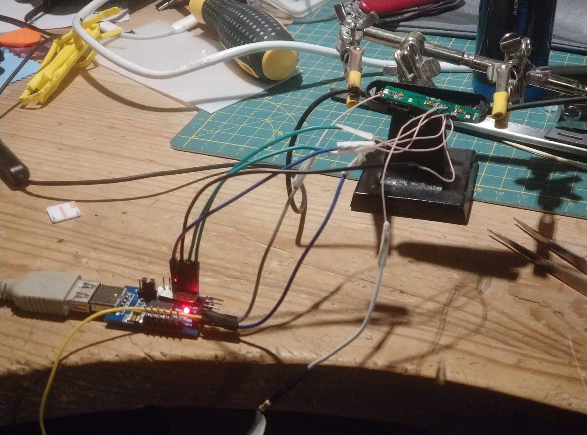

## Some Chineese CSR8645 bluetooth cable reverse engineering and fun with it's firmware

You will need
* [ftd232r usb thingmajig](https://ru.aliexpress.com/item/1-FT232-USB-UART/32903584835.html)
* 10k resistor
* some jumper wires
* [cable itself](https://www.aliexpress.com/item/KZ-Waterproof-Aptx-Bluetooth-Module-4-2-Wireless-Upgrade-Module-Cable-Detachable-Cord-Applies-Original-Headphones/32891194483.html)

### software part

You need to compile and install [this driver](https://github.com/lorf/csr-spi-ftdi#csr-chips-supported-by-programmer), put it into wine (and generally follow all instructions on it's readme).
Then install 2.6.6 from [this comment](https://github.com/lorf/csr-spi-ftdi/issues/30#issuecomment-398190388).
And for more fun you can install [this](https://drive.google.com/file/d/13yuOggcoSuvK2E_j7zRwjGfpYtcgJvO9/view?usp=sharing) as well (it was really hard to find that last one). Last one may require windows though.

### hardware part

switch ftd232r to 3.3V and connect things to ftd232r like this:

| Image   | FT232             |
|---------|--------           |
| 3V3     | 3V3               |
| CS#     | DTR#              |
| CLK     | RTS#              |
| MOSI    | RI#               |
| MISO    | DSR#              |
| SPI/PCM | 10k pullup to 3V3 |

### fun

Run `PSTool.exe`.
If everything has gone according to the plan, you will be able to connect to your csr through ftd232 by selecting it in connection method menu. You will see a LOT of settings, but don't worry, only ~60% of them will kill (or heat up!) your beloved csr.

So, before you do anything stupid, do a backup using `nvscmd.exe dump backup.xuv`. If you really did done messed up then, you can simply restore everything by doing `nvscmd.exe dump backup.xuv`.

You can change audio prompts and LED behaviour through that last software thing I gave in software section — it is hellishly powerful and buggy (at least on wine).
